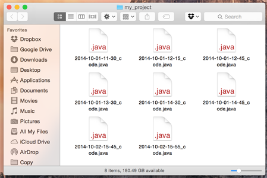
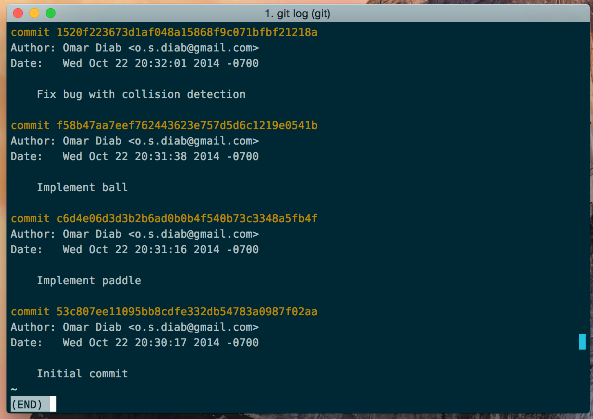
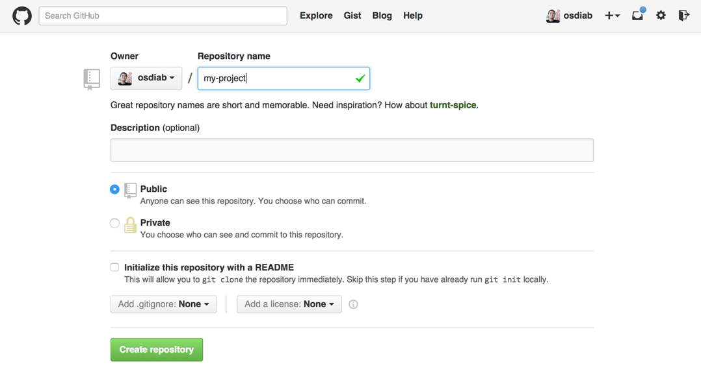
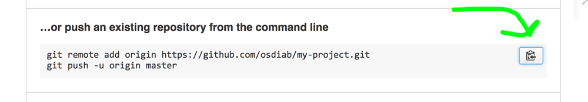
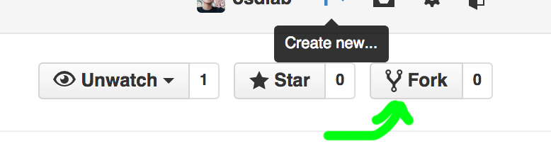
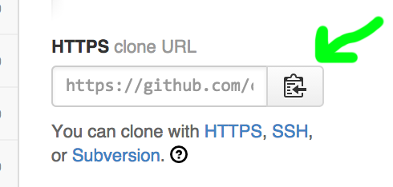
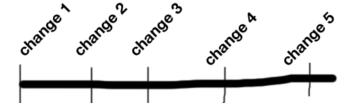

# Getting Started with Git and Github


## Practical Software Tools Workshop #1

### Omar Diab

---

# This talk is for...

* ... people who have rarely/never used version control before
* ... people who don't know what version control is
* ... people who want to write software at all

---

# Have you ever...

* Accidentally deleted a file you needed?
* Edited a document but wanted to undo your changes?
* Had trouble working with a project partner remotely?

---

# Version control to the rescue!

## It lets you...

* Revert your files or entire projects to previous states
* Review the changes you've made over time
* See who changed what, when.

---

# Git is a **distributed version control system**

## That leads us to two questions:

1. What is a **version control system** (VCS)?
2. What is a **distributed** VCS?

Let's start with #1.

---

# Version Control

## Definition: A system that records changes to files over time.

* Explore the history of a project
* Visualize the changes between versions
* Travel back and forth through time

---

# We don't need software for that!

1. Copy the file you want to change
2. Name the new file `[current date] [file name]`

Voila, changes recorded over time.

---

# But, that sucks.

* What if you get lazy, or forget?
* Many files all containing the same thing...
* What happened between each change?



---

# Local version control

* Every time you make a change, **commit** that version
* Give every "commit" a **name**
* The time and author are automatically recorded

---



---

# Where are these commits stored, then?

On your computer, a database stores all this information, so you don't have a ton of files in your
project.

---

# But what if...

* Your computer dies?
* You want to work with someone else (without loaning out your computer)?
* You accidentally delete/bork the entire project?

---

# **Centralized** Version Control

## Same thing, put the database on a server somewhere instead.

Now, "committing" sends your changes over the web to a server.

It serves as a central authority on your project's history.

* Subversion, Perforce

---

# But what if...

* That server goes down
* That server... *gasp*... dies?

---

# **Distributed** Version Control

## Everybody keeps the database of changes on their own computers!

If a server dies, just get the data from someone else.

* Mercurial (`hg`)
* **Git!**

---

# OK, enough background

## Let's dive in!


---

# Some initial configuration

Do the following so Git knows who you are:

```bash
$ git config --global user.name "John Doe"
$ git config --global user.email johndoe@example.com
$ git config --global core.editor vim
```

Replace `vim` with the editor of your choice, like `emacs`.

[Sublime Text can be done](https://help.github.com/articles/associating-text-editors-with-git/),
but it takes a little work.

---

# `git init`

Let's make a git repository! (Git projects are typically called repositories, or repos)

```bash
$ mkdir my_project
$ cd my_project
$ git init
Initialized empty Git repository in
/Users/osdiab/my_project/.git/
```

---

# What did that do?

Try listing out what's in the folder.

```bash
$ ls
```

There's nothing. But what if you show hidden files?

```bash
$ ls -a
.    ..   .git
```

---

# The `.git` folder

There's a hidden folder (in UNIX, any file starting with a period is hidden) called `.git` that
contains your **local** "database" of this repo.

*It's not on the internet (yet)!*

No need to delve into it now, but the presence of the `.git` file is the only thing that
distinguishes a Git repo from any other directory.

---

# `git add`

Git needs to be told what files and changes it should pay attention to.

Let's create a file and add it!

```bash
$ touch README.txt
```

Open the file in your editor of choice and add some text. Then,

```bash
$ git add README.txt
$ git status
```

---

# `git commit`

Lets commit our new file!

```bash
$ git commit -m "Added README"
[master (root-commit) a4971cb] Added README
 1 file changed, 0 insertions(+), 0 deletions(-)
 create mode 100644 README.txt
```

And let's see the commit record:

```bash
$ git log
```

---

# Quiz: what exactly did that just do?

Is your README on the internet somehow?

---

# Exercise: Make a change to your `README`, add the change, and commit it

---

# `git checkout`, we meet at last.

This command is confusing since it has many meanings, but here's the first one:

What if I want to undo some changes I haven't committed yet?

```bash
# ... make some changes to <filename>...
$ git checkout <filename>  # restore a changed file
```

Try changing `README.txt` and running `git checkout README.txt`. Tada! You've "checked out" the
version at the current commit.

---

# Stepping back: the git workflow


---

# `git diff`

The `diff` command shows you the difference between what's currently in your project folder, and
other versions of your project.

Let's make another change to the `README`. Then, run:

```bash
$ git diff  # compare unstaged changes to the current commit
```

---

# `git diff`, continued

But what if you want to see the diff with a previous version? Add the commit hash you want to
compare against as an argument to `git diff`.

```bash
$ git log  # find and copy the commit hash you want...
$ git diff a4971cb5813a3da...  # your hash here!
```

---

# `git checkout`, redux

We meet again, old foe!

What if I want to go back in time and **check out** what happened at an earlier revision?

```bash
$ git log  # find a commit you want to go to...
$ git checkout a4971cb5813a3da...  # your commit hash here!
```

---


Take a look at README—gee whiz!

---

# OK, that was cool, but get me back to the present!


For now, type in this magic:

```bash
$ git checkout master
```

I'll explain it in a few slides.

---

# Whew! That was a lot.

Here's a review of the commands we learned so far:

```bash
$ git init # create a new git project
$ git add  # add a new file or a change to the project
$ git commit  # save a new version of your code, locally
$ git status  # see the current state of the repository
$ git log  # view all versions of the repository so far
$ git diff  # view [unstaged] changes made to your code
$ git checkout <filename>  # restore a changed file
$ git checkout <commit-hash>  # enter a version of the repo
```

And in case you were wondering, this gets you a version of a specific file:

```bash
$ git checkout <commit-hash> <filename>
```

---

# What did we just learn?

These commands emulate the behavior of the local version control system described earlier.

But how can we start collaborating? My git repository is currently only on my computer.

---

# Github

Head over to [github.com](https://github.com) and let's get your project online.

---

# Step 1: Create a project


Click on the plus sign in the upper right hand corner, then click "New Project".

---

# Step 1b: Give the project a name.

Leave it public, don't initialize it. Add a description if you want.



---

# Step 2: Get your project online

Copy the command about halfway down that says "push an existing repository from the command line."
Paste it into your terminal and hit enter.



---

# `git remote`

Before we can send our project data to Github, we need to let Git know where to send the data to.

```bash
# add a remote
$ git remote add <remote-name> <url-to-git-project>
```

In the case of Github's recommended code, we're setting the **origin** repository to refer to
Github's repository.

---

# `git push`

Then, once you have a remote repo setup, you can "push" (i.e. send) your code to it.

```bash
$ git push <remote-name> <branch-name>
```

We haven't talked about branches yet, but the changes we've been making have been to the default,
**master** branch; and we want to send our versions to Github, which is at **origin**.

---

# And it's online! Cool beans :)

Since the projects are public, now we can all download each other's projects.

I'll teach you how, by having you download a project I prepared for this workshop!

---

# Let's work together on a project on Github!

Go to [github.com/osdiab/git-workshop](https://github.com/osdiab/git-workshop) now!

Then, click the "Fork" button in the top right corner.



You now have made a copy of my project, in your account.

---

# `git clone`

This command lets you copy an existing git project.

If the project is hosted on the internet (like on Github), it downloads it for you.

Let's see it in action!

---

# Copy the clone URL

Copy it from the text box on the right of your screen. Make sure it says HTTPS!
(We haven't set up the other methods yet)



---

# Clone it!

Then run:

```bash
# First enter a non-git directory...
$ cd ~

# Then, paste the url below:
$ git clone https://github.com/<username>/git-workshop.git

# See that it's there!
$ ls
```

---

# We could just start making changes immediately...

... but now that we've all got a copy of the same project, this might be a bad idea!

## What might go wrong?

---

# Think of the history of a project as a timeline of changes.



* If I make a bunch of changes at the same time that you did...
  * How do we decide whose changes come first?
  * What if we edit the same parts of the same files?

---

## Collaboration makes things trickier!

We need the history to not just be a straight line... There needs to be *forks* in the road...

We need **branching**!


---

# Branching Demo

Go to
[www.wei-wang.com/ExplainGitWithD3](http://www.wei-wang.com/ExplainGitWithD3/#)
and click on "Free Playground."

---

# `git branch`

By default, when you create or clone a repository, you work on the `master` branch.

To see this, try running `git status` and read the first line of the output.

```bash
$ git branch  # list branches you know about
$ git branch <new-branch-name>  # create a new branch
```

---

# Let's make a branch!

```bash
$ git branch add-osdiab-to-list
```

Try running `git branch`. There it is!

We created a branch, but we're not "in" it yet. To add commits to a specific branch, you must enter
it. But how?

---

# Go home `git checkout`, you're drunk

... with power!

```bash
$ git checkout <branch-name>  # enter a branch
```

Try entering your newly made branch. How can you tell you're in it?

---

# Exercise: Take a minute to add some feedback.

## Follow what `README.md` specifies

**Note**: it is displayed prettily on the repo's git page :) Ask me later about Markdown.

---

# Exercise: Push it to Github

## Before you do this, somebody tell me: How do I push to Github my new branch?

Tip: Remember the syntax of `git push`...

```bash
$ git push <remote-name> <branch-name>
```

---

# Collaborating

OK, so now your branch with your beautiful feedback is on Github.

But it's specifically in a branch on your fork of the project, not on my copy of the project!

In theory, I could come over to your project page and look through the code to find it myself. But
there's gotta be a better way!

---

# Pull Requests

This is Github's way of handling code reviews.

If you've made changes to a repository on a branch, you can ask the owner of the repository to look
over your code.

If they approve of it, they can "merge" your changes into their repo.

---

# Merge?

Remember how your branch came out of the master branch?

At some point, you probably want your changes to end up in the master branch again.


---

# `git merge`

To incorporate the changes from one branch into another, enter the branch you want to merge _into_,
and run:

```bash
# merge specified branch into master
$ git checkout master
$ git merge <branch-to-merge>
```

Git automatically tries to merge the branches; this doesn't always work.

---

# But... now that my PR is accepted and merged, why isn't it in my project?

The change was merged into **the owner's copy** of the project, not yours.

Remember, it's a **distributed** VCS, so everybody's copies of the repo are independent!

You need to download the new version of the original owner's repo to get yourself up to date.

---

# Exercise: add the original repository as a remote

The original repo was on my acount (osdiab), so how about calling it that?

Hint:

```bash
# add a remote
$ git remote add <remote-name> <url-to-git-project>
```

---

# `git pull`

To download changes and merge it into the current branch, do this:

```bash
# merge the "osdiab" branch to your master branch
$ git checkout master
$ git pull osdiab master
```

---

# Push it, and you're done!

```bash
git push origin master
```

---

# Review

```bash
$ git init # create a new git project
$ git add  # add a new file or a change to the project
$ git commit  # save a new version of your code, locally
$ git status  # see the current state of the repository
$ git log  # view all versions of the repository so far
$ git diff  # view [unstaged] changes made to your code
$ git checkout <filename>  # restore a changed file
$ git checkout <commit-hash>  # enter a version of the repo
$ git checkout <branch> # enter a branch
$ git remote add <name> <url>  # add a remote server
$ git branch  # view all branches
$ git branch <branch-name>  # create a branch
$ git merge <branch>  # merge a branch into the current one
$ git pull <remote> <branch> # download/merge a branch
$ git push <remote> <branch> # send a branch to a server
```

---

# Git is a tool.

## As such, the best way you have to learn it, is to use it.

* for your academic projects (BitBucket)
* for your graphic designs
* for your non-code projects
* for sharing data

So go out there, get some practice, and contribute!

---

# Helpful resources

* [Pro Git book](http://git-scm.com/book) (free, online, thorough and well-written reference)
* [Intro to Git/Github course: Udacity](https://www.udacity.com/course/ud775)
